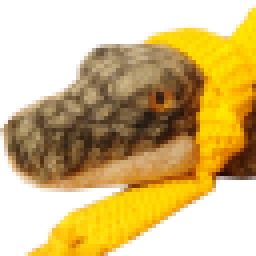
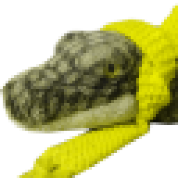
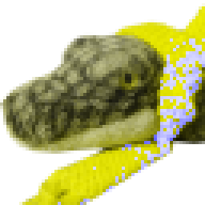
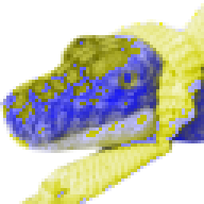

# Simulate Color Blindness

This is a fork of <https://github.com/tsarjak/Simulate-Correct-ColorBlindness>

## This fork

- Alpha channel (transparency) is supported
- fix rotation issue

The _color blindness correction_ feature has been **removed**.

> I couldn't manage to make it work correctly (transparency + no picture rotation) -_-'

## Install

```
pip install -r requirements
```

## Usage

```
usage: transform.py [-h] [-input INPUT] [-output OUTPUT] (-sp | -sd | -st)

Simulate Color Blindness

optional arguments:
  -h, --help      show this help message and exit
  -input INPUT    Path to input image
  -output OUTPUT  Path for output image
  -sp             Simulate Protanopia (Common Red-Green Blindness)
  -sd             Simulate Deutranopia (Rare Red-Green Blindness)
  -st             Simulate Tritanopia (Blue-Yellow Color Blindness)
```

## Examples

### original



### Protanopia

```
python transform.py -sp -input res/picoJr.png -output res/picoJr-sp.png
```



### Deutranopia

```
python transform.py -sd -input res/picoJr.png -output res/picoJr-sd.png
```



### Tritanopia

```
python transform.py -st -input res/picoJr.png -output res/picoJr-st.png
```


